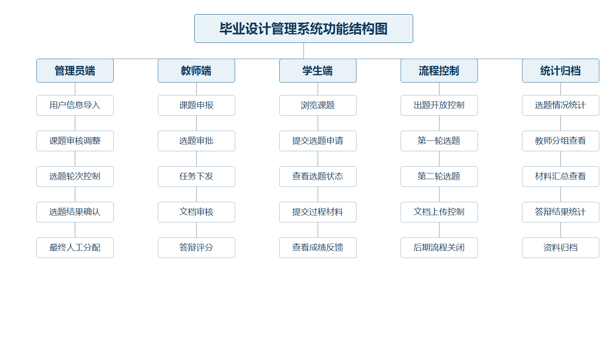
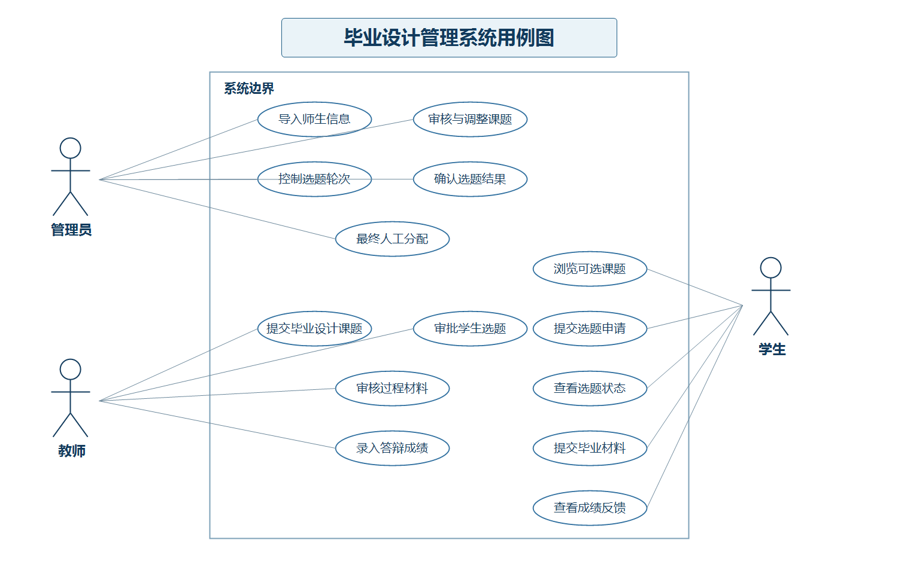
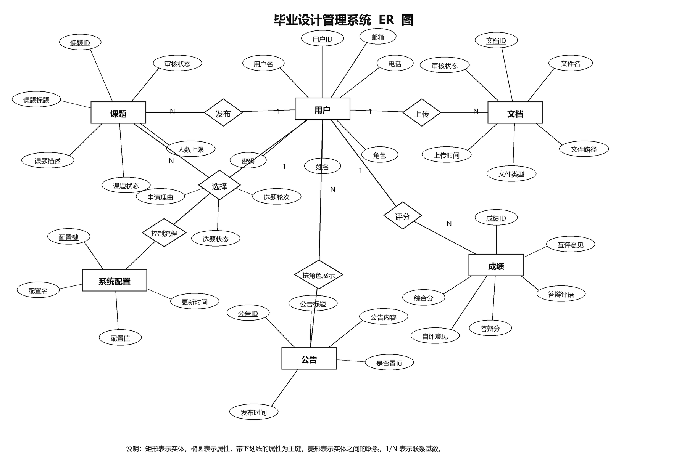
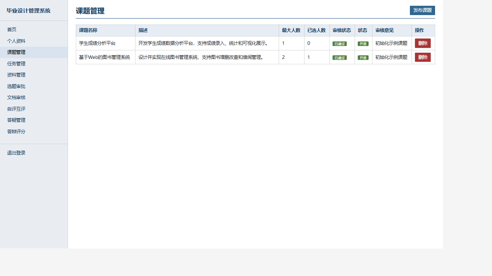
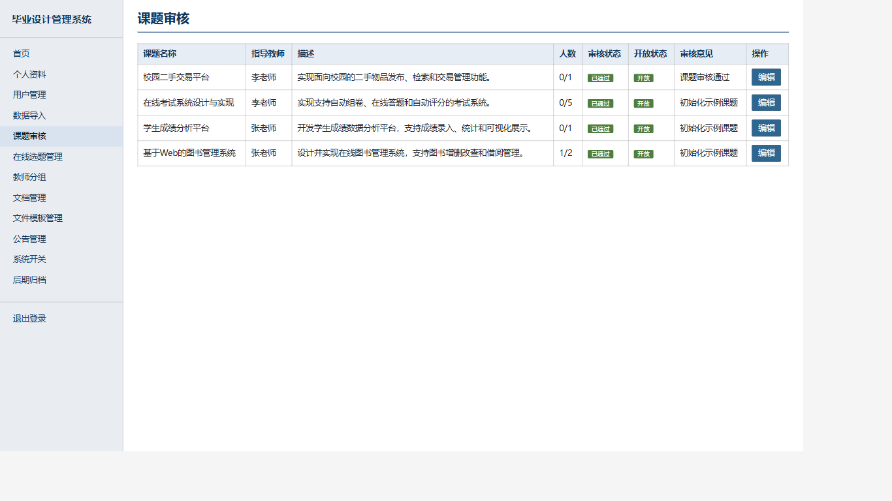
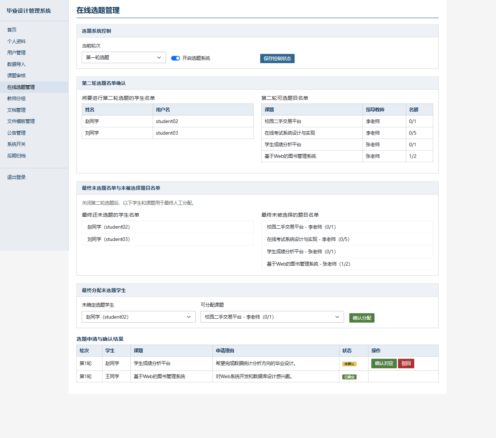
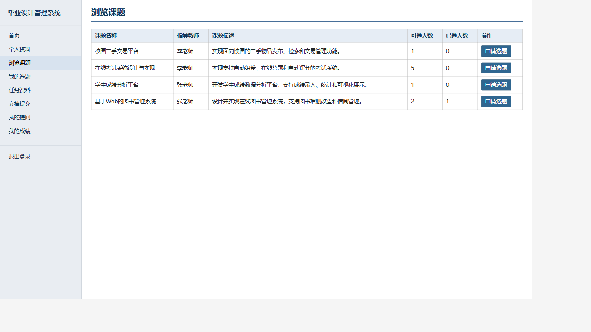
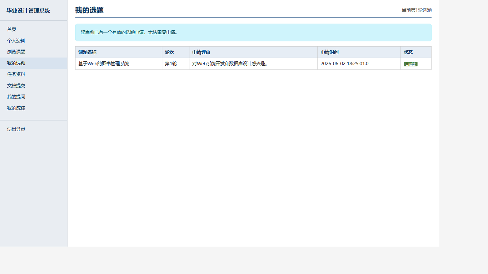
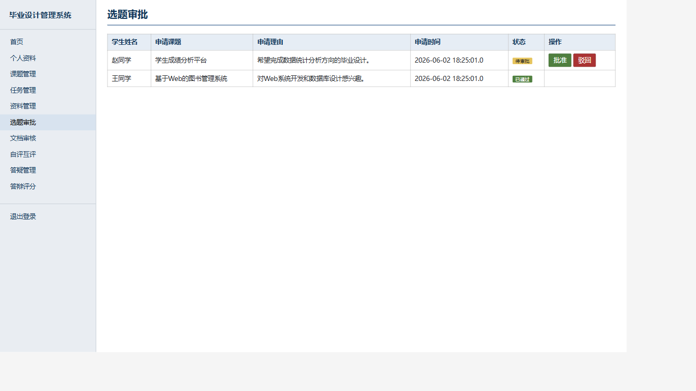

# 人工智能学部本科生毕业设计管理系统
## ——课题申报审核与在线选题管理模块设计与实现

> Web 系统设计与应用 课程大作业报告  
> 学号_姓名：________________  
> 班级：数科 2023 级　　院（系）：计算机科学与技术学院  
> 时间：2026 年 06 月

---

## 一、引言

毕业设计是本科教学过程中的重要实践环节，涉及学生资格确认、教师出题、题目审核、学生选题、过程材料提交、教师评阅、答辩评分和资料归档等多个阶段。传统人工管理方式通常依赖线下表格、即时通信工具和人工汇总，容易出现信息分散、流程状态不清晰、选题结果统计不及时、材料归档不规范等问题。因此，设计一个面向毕业设计全过程的 Web 管理系统，能够提高毕业设计管理工作的规范性和效率。

本系统以人工智能学部本科生毕业设计管理场景为背景，采用 JavaWeb 技术实现管理员、教师和学生三类用户的协同管理。结合课程设计要求，系统对实际业务角色进行了适当简化，将教务员和系主任的管理职责合并到管理员角色中，由管理员统一完成基础数据导入、课题审核、选题控制、结果确认和最终人工分配等工作。

本报告重点围绕“课题申报审核与在线选题管理模块”展开说明。该模块覆盖毕业设计前期最核心的题目管理与师生匹配流程，包括教师申报课题、管理员审核调整、学生第一轮和第二轮选题、管理员确认题目与学生对应关系，以及对未选题学生进行人工分配等功能。通过该模块，可以体现毕业设计管理系统中多角色协作、流程控制和数据状态管理的设计思路。

---

## 二、需求分析

### 2.1 系统业务背景

根据课程任务书中的毕业设计管理流程，系统需要覆盖从基础数据导入到选题确认、过程材料提交、成绩录入和后期归档的主要环节。考虑到课程设计系统规模有限，本系统设置管理员、教师、学生三类用户，其中管理员承担教务员和系主任的管理职责。

系统的核心业务流程可以概括为：管理员导入教师和学生基础信息；教师在规定时间段内提交毕业设计题目；管理员对题目进行审核、修改和发布；学生在选题系统开放期间进行第一轮和第二轮选题；管理员确认题目与学生的对应关系，并为最终未选题学生进行人工分配；后续由学生提交材料，教师完成文档审核、成绩评定和答辩评分。

### 2.2 需求分析结构图

系统功能按照用户角色和业务阶段划分为管理员端、教师端、学生端、流程控制和统计归档五个部分。管理员端负责全局管理，教师端负责课题与指导工作，学生端负责选题与材料提交，流程控制负责不同阶段的开放状态管理，统计归档负责后期汇总。



### 2.3 用例图

系统主要参与者包括管理员、教师和学生。管理员负责导入基础数据、审核与调整课题、控制选题轮次、确认选题结果和最终人工分配；教师负责提交毕业设计课题、审批学生选题、审核过程材料和录入答辩成绩；学生负责浏览可选课题、提交选题申请、查看选题状态、提交毕业材料和查看成绩反馈。



### 2.4 功能需求文字描述

管理员功能需求如下：管理员可以维护学生、教师和管理员账号；可以批量导入有资格参加毕业设计的学生和教师基本信息；可以审核教师提交的课题，支持通过、驳回和修改；可以控制当前选题轮次和选题系统开关；可以查看第一轮和第二轮选题情况；可以确认题目与学生的对应关系；可以为最终未选题学生人工分配剩余课题；可以查看全局文档、成绩和归档情况。

教师功能需求如下：教师可以在出题开放期间提交毕业设计课题，设置课题名称、课题描述和可选人数；可以查看自己课题的审核状态；可以审批学生提交到本人课题下的选题申请；可以下发阶段任务和参考资料；可以审核学生提交的开题报告、中期检查报告、毕业论文和源代码等材料；可以填写自评、互评意见以及答辩成绩。

学生功能需求如下：学生可以查看已审核通过且仍有名额的课题；可以在选题开放期间提交选题申请；可以查看自己的选题轮次、申请状态和审核结果；选题通过后，可以提交开题报告、中期检查报告、毕业论文和源代码等过程材料；可以向指导教师提问并查看答复；可以查看文档审核结果、综合成绩和答辩成绩。

### 2.5 重点模块需求

本报告重点描述“课题申报审核与在线选题管理模块”。该模块需要满足以下需求：

| 需求编号 | 需求内容 |
| --- | --- |
| R1 | 教师能够提交、编辑和删除自己的毕业设计课题。 |
| R2 | 管理员能够审核、修改、通过或驳回教师提交的课题。 |
| R3 | 只有审核通过且处于开放状态的课题才允许学生选择。 |
| R4 | 管理员能够开启或关闭选题系统，并设置当前选题轮次。 |
| R5 | 学生能够在选题开放时提交选题申请，并查看申请状态。 |
| R6 | 系统需要限制学生同时只能存在一个有效选题申请。 |
| R7 | 教师或管理员确认选题后，系统需要维护课题已选人数。 |
| R8 | 第一轮结束后，管理员能够查看未选学生和剩余课题，组织第二轮选题。 |
| R9 | 第二轮结束后，管理员能够为最终未选题学生人工分配课题。 |

---

## 三、系统设计

### 3.1 概要设计

系统采用 JSP + Servlet + JDBC 的 MVC 分层结构。浏览器端通过 JSP 页面展示数据和提交表单；Servlet 作为控制器处理请求、校验参数和调度业务逻辑；DAO 层封装数据库访问；实体类负责承载用户、课题、选题、文档、成绩等业务数据；Filter 负责登录校验、角色访问控制和字符编码处理。

系统整体分层如下：

| 层次 | 对应目录 | 主要职责 |
| --- | --- | --- |
| View | `src/main/webapp/WEB-INF/jsp` | JSP 页面展示、表单提交、结果渲染 |
| Controller | `src/main/java/controller` | 接收请求、处理业务分支、调用 DAO、控制跳转 |
| DAO | `src/main/java/dao` | 封装 SQL 和数据库增删改查 |
| Model | `src/main/java/bean` | 定义用户、课题、选题、文档、成绩等实体 |
| Filter | `src/main/java/filter` | 登录认证、角色权限、编码处理 |
| Util | `src/main/java/util` | 密码处理、参数解析、文件上传等工具 |

用户请求处理流程为：用户访问页面或提交表单；`EncodingFilter` 统一处理 UTF-8 编码；`AuthFilter` 判断用户是否登录并检查角色权限；Controller 读取请求参数并调用 DAO；DAO 通过 `SQLHelper` 操作 MySQL 数据库；Controller 将结果写入 request 或 session；JSP 渲染页面返回浏览器。

### 3.2 详细设计

系统按角色划分为管理员端、教师端和学生端。

管理员端包括用户管理、数据导入、课题审核、在线选题管理、教师分组、文件模板管理、公告管理、文档管理、系统开关和后期归档等功能。其中课题审核和在线选题管理是本文重点，分别由 `AdminTopicReviewController` 和 `AdminSelectionController` 处理。

教师端包括课题管理、任务管理、资料管理、选题审批、文档审核、自评互评、答疑管理和答辩评分等功能。其中课题申报由 `TeacherTopicController` 处理，选题审批由 `TeacherSelectionController` 处理。

学生端包括浏览课题、我的选题、任务资料、文档提交、我的提问和我的成绩等功能。其中学生浏览课题由 `StudentTopicController` 处理，提交与查看选题申请由 `StudentSelectionController` 处理。

重点模块对应的主要控制器如下：

| 控制器 | 主要职责 |
| --- | --- |
| `AdminTopicReviewController` | 管理员查看全部课题，审核、驳回或修改教师提交的课题。 |
| `AdminSelectionController` | 管理员控制选题轮次，确认选题结果，查看未选学生和剩余课题，执行最终人工分配。 |
| `TeacherTopicController` | 教师提交、编辑和删除自己的课题。 |
| `TeacherSelectionController` | 教师审批学生提交到本人课题下的选题申请。 |
| `StudentTopicController` | 学生查看可选课题列表。 |
| `StudentSelectionController` | 学生提交选题申请并查看自己的选题状态。 |

### 3.3 数据库设计

系统数据库名为 `graduation_design`，初始化脚本位于 `sql/init.sql`。数据库共设计 12 张表，覆盖用户、课题、选题、文档、任务、资源、模板、答疑、评价、答辩成绩、公告和系统开关。

数据库 E-R 图如下：



| 表名 | 作用 |
| --- | --- |
| `users` | 管理员、教师、学生账号信息，使用 `role` 区分角色。 |
| `topics` | 教师发布的毕业设计课题，记录审核状态、开放状态和可选人数。 |
| `topic_selections` | 学生选题申请，记录学生、课题、申请理由、轮次和状态。 |
| `documents` | 学生提交的开题、中期、终稿和源代码材料。 |
| `tasks` | 教师下发的阶段任务。 |
| `teacher_resources` | 教师上传的参考资料。 |
| `file_templates` | 管理员维护的文件模板。 |
| `questions` | 学生提问和教师答疑记录。 |
| `evaluations` | 自评、互评意见和综合成绩。 |
| `defense_scores` | 答辩成绩与答辩意见。 |
| `announcements` | 系统公告。 |
| `system_settings` | 出题、选题、文档上传等流程开关和当前轮次。 |

重点模块主要涉及 `users`、`topics`、`topic_selections` 和 `system_settings` 四张表。`topics.teacher_id` 关联教师账号，`topics.review_status` 表示管理员审核状态，`topics.status` 表示是否向学生开放；`topic_selections.student_id` 关联学生账号，`topic_selections.topic_id` 关联课题，`round_no` 区分第一轮和第二轮选题，`status` 表示待确认、已确定或已驳回。

### 3.4 功能设计

系统功能设计围绕毕业设计工作流程展开，具体包括以下部分：

| 功能模块 | 功能说明 |
| --- | --- |
| 登录与权限管理 | 用户登录后根据角色进入不同菜单，未登录和跨角色访问会被拦截。 |
| 基础数据管理 | 管理员维护学生、教师账号，并支持批量导入基础信息。 |
| 课题申报审核 | 教师提交课题，管理员审核、修改、通过或驳回课题。 |
| 在线选题管理 | 管理员控制轮次，学生提交申请，教师或管理员确认选题关系。 |
| 人工分配管理 | 两轮选题结束后，管理员为未选题学生分配剩余课题。 |
| 过程材料管理 | 学生提交文档，教师审核文档并填写评分和反馈。 |
| 成绩与答辩管理 | 教师录入综合评价和答辩成绩，学生查看成绩反馈。 |
| 后期归档管理 | 管理员查看材料、成绩和答辩统计，完成后期归档。 |

### 3.5 非功能设计

安全设计方面，系统通过 `AuthFilter` 对受保护路径进行统一拦截，要求用户登录后才能访问后台页面；管理员、教师和学生分别访问 `/admin/*`、`/teacher/*`、`/student/*` 路径，跨角色访问会被拦截。教师侧涉及修改课题、审批选题、审核文档等写操作时，DAO 层 SQL 增加 `teacher_id` 归属条件，防止通过篡改 ID 操作其他教师的数据。密码使用 MD5 哈希后存储，避免明文保存。

日志设计方面，当前课程设计版本主要依赖 Tomcat 控制台日志和异常堆栈输出进行调试。Controller 捕获异常后抛出 `ServletException`，由容器记录错误信息。后续如果扩展为正式系统，可以引入 Logback 或 Log4j，将登录、课题审核、选题确认、人工分配、成绩录入等关键操作写入业务日志表，便于追踪责任和审计。

并发设计方面，本系统面向课程设计演示场景，实际并发量较低。系统通过选题开关、有效申请限制、课题人数上限检查和课题满员自动关闭降低冲突风险。若扩展到真实高并发环境，选题确认和人工分配应进一步使用数据库事务，并在更新课题人数时增加 `selected_count < max_students` 条件，避免多个用户同时确认同一课题造成超额选择。

---

## 四、关键模块设计与实现

### 4.1 课题申报审核模块

#### 4.1.1 流程分析

课题申报审核模块用于完成教师出题和管理员审核。教师在出题开放期间填写课题名称、课题描述和可选人数，提交后课题进入待审核状态。管理员在课题审核页面查看全部课题，可以根据题目质量和人数安排进行修改、通过或驳回。课题审核通过后，学生端才能看到该课题并提交选题申请。

该模块对应任务书中的“老师在规定时间段内出题”“系主任审核题目”“系主任对部分题目进行修改与调整”“确定所有题目并公布”等流程。在本系统中，系主任相关职责合并到管理员角色中实现。

#### 4.1.2 核心代码实现

管理员审核课题由 `AdminTopicReviewController` 处理。控制器根据 `opttype` 参数判断当前操作类型，分别调用通过、驳回或修改方法。

```java
String action = request.getParameter("opttype");

if ("approve".equals(action)) {
    approveTopic(request, id);
}

if ("reject".equals(action)) {
    rejectTopic(request, id);
}

if ("edit".equals(action)) {
    editTopic(request, id);
}
```

课题审核通过或驳回时，DAO 层更新 `review_status` 和 `review_comment`，并根据审核结果决定课题是否开放。

```java
public void updateReview(int id, String reviewStatus, String reviewComment)
        throws SQLException {
    String status = "approved".equals(reviewStatus) ? "open" : "closed";
    String sql = "UPDATE topics SET review_status=?, review_comment=?, status=? WHERE id=?";
    SQLHelper.executeUpdate(sql, reviewStatus, reviewComment, status, id);
}
```

管理员修改课题时，可以调整题目名称、题目描述、可选人数和开放状态，使题目审核过程不仅是简单通过或驳回，也能覆盖任务书要求的“修改与调整”。

```java
Topic topic = new Topic();
topic.setId(id);
topic.setTitle(request.getParameter("title"));
topic.setDescription(request.getParameter("description"));
topic.setMaxStudents(maxStudents);
topic.setStatus(request.getParameter("status"));
topicDao.update(topic);
```

#### 4.1.3 结果截图

教师课题管理页面用于教师提交和维护自己的毕业设计课题。



管理员课题审核页面用于审核、修改、通过或驳回教师提交的课题。



#### 4.1.4 使用技术

该模块主要使用 JSP 表单提交、Servlet 控制器、JDBC 数据访问和 MySQL 状态字段控制。JSP 负责展示课题列表和审核弹窗，Servlet 负责区分操作类型并调用 DAO，DAO 负责更新 `topics` 表中的审核状态和开放状态。

### 4.2 在线选题管理模块

#### 4.2.1 流程分析

在线选题管理模块用于完成学生选题、教师审批、管理员确认、第二轮选题和最终人工分配。管理员可以设置当前选题轮次和选题系统是否开放。学生在系统开放时浏览可选课题并提交申请。教师或管理员确认申请后，系统更新选题状态并增加课题已选人数。第一轮结束后，管理员查看仍未确定课题的学生和仍有名额的课题，组织第二轮选题。第二轮结束后，管理员对最终未选题学生进行人工分配。

该模块对应任务书中的“开启选题系统”“学生在规定时间内进行选题”“确定题目与学生的一一对应性”“确定第二轮选题名单和题目名单”“进行第二轮选题”“最终人工分配未选题学生”等流程。

#### 4.2.2 核心代码实现

学生提交选题申请时，系统首先判断选题系统是否开放，并检查该学生是否已经存在有效申请。通过检查后，系统读取当前选题轮次，写入 `topic_selections` 表。

```java
if (!settingDao.isOpen("student_selection_open")) {
    return;
}

if (selectionDao.hasActiveSelection(user.getId())) {
    return;
}

int roundNo = parseInt(settingDao.getValue("selection_round"), 1);
selectionDao.insert(user.getId(), topicId, reason, roundNo, "pending");
```

管理员在选题管理页面可以保存当前轮次和选题系统开放状态。

```java
private void saveSettings(HttpServletRequest request) throws Exception {
    settingDao.update("student_selection_open",
            request.getParameter("student_selection_open") != null);
    settingDao.updateValue("selection_round",
            request.getParameter("selection_round"));
}
```

管理员最终人工分配时，系统判断学生和课题是否有效，并确认课题仍有剩余名额。分配成功后，系统直接插入 `approved` 状态的选题记录，并增加课题已选人数。

```java
Topic topic = topicDao.findById(topicId);
if (!canSelectTopic(topic) || selectionDao.hasActiveSelection(studentId)) {
    return;
}

int roundNo = parseInt(settingDao.getValue("selection_round"), 1);
selectionDao.insert(studentId, topicId, "管理员最终分配", roundNo, "approved");
addSelectedCount(topicId);
```

课题人数增加后，系统会检查是否达到上限。如果已选人数达到最大人数，则自动关闭课题，避免学生继续申请。

```java
private void addSelectedCount(int topicId) throws Exception {
    topicDao.incrementSelected(topicId);
    topicDao.closeIfFull(topicId);
}
```

#### 4.2.3 结果截图

管理员在线选题管理页面用于控制选题轮次、查看第二轮名单、查看最终未选题学生和剩余题目，并执行人工分配。



学生浏览课题页面用于查看可选题目并提交选题申请。



学生我的选题页面用于查看申请轮次和审核状态。



教师选题审批页面用于处理学生提交到本人课题下的选题申请。



#### 4.2.4 使用技术

该模块使用 `system_settings` 表控制选题流程状态，使用 `topic_selections` 表记录学生申请和轮次信息，使用 `topics.selected_count` 与 `topics.max_students` 控制课题人数上限。前端通过 JSP 和 JSTL 渲染表格、状态标签和操作按钮，后端通过 Servlet 处理表单提交，通过 DAO 层完成数据库状态更新。

---

## 五、系统运行与测试

### 5.1 开发环境与技术栈

| 项目 | 内容 |
| --- | --- |
| 开发语言 | Java 8 |
| Web 技术 | JSP、Servlet 3.1、JSTL |
| 数据库 | MySQL 8 |
| 数据访问 | 原生 JDBC，自封装 `SQLHelper` |
| 前端 | HTML5、CSS3、JavaScript、Ajax |
| 构建工具 | Maven |
| 运行容器 | Apache Tomcat 9 |
| 运行地址 | http://localhost:8080/graduation-design/ |

### 5.2 运行方式

初始化数据库时需要指定 UTF-8 编码，避免中文数据乱码：

```powershell
mysql --default-character-set=utf8mb4 -uroot -p < sql/init.sql
```

使用 Maven 构建 WAR 包：

```powershell
mvn clean package
```

使用项目提供的脚本部署到 Tomcat：

```powershell
.\scripts\quick-deploy-tomcat9.ps1 -ProjectDir "E:\Desktop\web_course_design" -TomcatHome "E:\apache-tomcat-9.0.115" -ContextPath "graduation-design" -Port 8080
```

### 5.3 测试账号

| 角色 | 用户名 | 密码 |
| --- | --- | --- |
| 管理员 | admin | admin123 |
| 教师 | teacher01 | 123456 |
| 学生 | student01 | 123456 |

### 5.4 测试内容

测试围绕登录、角色权限、页面访问、数据库读写、中文编码和越权防护展开，重点验证：

- 管理员可以访问课题审核、在线选题管理、系统开关和归档页面。
- 教师可以提交毕业设计课题，并查看审核状态。
- 教师可以审批学生提交到本人课题下的选题申请。
- 学生只能在选题系统开放时提交选题申请。
- 学生同时只能保留一个待审核或已通过的有效申请。
- 管理员可以控制第一轮和第二轮选题状态。
- 管理员可以查看未选题学生和剩余课题，并完成最终人工分配。
- 课题达到可选人数上限后会自动关闭。
- 未登录访问受保护页面会跳转登录页，跨角色访问会被拦截。
- 教师无法通过篡改 ID 操作其他教师名下的课题、文档或选题申请。

---

## 六、系统开发过程总结

### 6.1 已构建和已实现模块

本系统已经构建了管理员、教师和学生三类用户端。管理员端实现了用户管理、数据导入、课题审核、在线选题管理、教师分组、文件模板管理、公告管理、文档管理、系统开关和后期归档等模块；教师端实现了课题管理、任务管理、资料管理、选题审批、文档审核、自评互评、答疑管理和答辩评分等模块；学生端实现了浏览课题、我的选题、任务资料、文档提交、我的提问和我的成绩等模块。

其中，课题申报审核与在线选题管理是本次报告重点实现和说明的模块。该模块较完整地覆盖了教师出题、管理员审核与调整、题目发布、学生第一轮选题、第二轮选题、选题结果确认和最终人工分配等流程。

### 6.2 尚需完善的模块

由于课程设计时间和系统规模限制，仍有部分功能可以继续完善。首先，当前系统没有单独设置系主任角色，而是将其职责合并到管理员中，后续可以增加独立的系主任角色和更细粒度的权限控制。其次，当前日志设计主要依赖 Tomcat 输出，后续可以增加业务操作日志表，记录课题审核、选题确认、人工分配和成绩录入等关键操作。再次，当前选题人数控制适合低并发演示场景，后续可以使用事务和条件更新增强并发安全。最后，系统可以进一步增加查重检测、消息通知、导出归档压缩包等功能。

### 6.3 开发中遇到的问题与解决方案

开发过程中遇到的主要问题包括中文乱码、数据库连接释放、角色越权和选题流程状态不清晰。中文乱码问题主要出现在 SQL 文件导入阶段，解决方案是在导入时指定 `--default-character-set=utf8mb4`，并在过滤器中统一设置请求编码。数据库连接释放问题通过完善 `SQLHelper.close()` 和异常路径下的资源关闭逻辑解决。角色越权问题通过 `AuthFilter` 做路径级权限拦截，并在教师侧 DAO 更新语句中附加 `teacher_id` 归属条件解决。选题流程状态不清晰的问题通过增加 `system_settings` 表中的选题开关和当前轮次字段解决，使第一轮、第二轮和最终人工分配流程能够在页面上明确展示。

### 6.4 开发意义

通过本次系统开发，我对 Web 应用的分层结构、Servlet 请求处理、JSP 页面渲染、JDBC 数据访问和数据库表设计有了更完整的理解。毕业设计管理系统的业务流程较长，涉及多角色协作和多状态流转，因此在实现过程中需要不断把实际流程转化为数据库字段、页面操作和后端控制逻辑。这个过程加深了我对需求分析、系统设计和代码实现之间关系的认识，也提高了我处理实际业务系统的能力。
